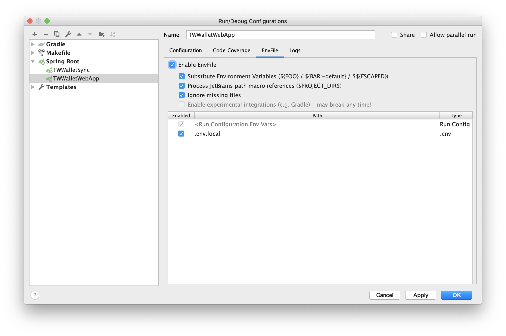

## TW Wallet backend
### This project provide backend service for TW Wallet.

#### RunTime
* Java 1.8
* PostgreSQL/H2
* Gradle 5.2.1

#### QuickStart


##### 1. start by gradlew
```sh
set environment in .env.local 
source ./loadenv.sh
./gradlew :tw-wallet-webapp:bootRun
```

##### 2. debug by idea

install plugin "env file"




##### 3. other useful cmd

* `./gradlew clean` : clean `build` folder
* `./gradlew build -x integTest` : build application
* `./gradlew test` : run unit test
* `./gradlew integTest` : run integration test
* `./gradlew bootRun` : run application
* `./gradlew flywayMigrate`: create table
* `./gradlew flywayClean`: delete table
* `./gradlew generateWalletJooqSchemaSource`:  generate jooq

#### Use different environments in application config files
The **default environment** is `test`.

flyway usage:
* `./gradlew -Penv=test flywayMigrate` or `./gradlew flywayMigrate`: create table in h2 database in your home dir is likes `~/tw_wallet.*`
* `./gradlew -Penv=local flywayMigrate`: create table in postgre: create table in postgres

jooq usage:
* `./gradlew generateWalletJooqSchemaSource`: generate jooq source code for h2 database in `build/genrated-sources/jooq/com/thoughtworks/wallet/gen`
* `./gradlew -Penv=local generateWalletJooqSchemaSource`: generate jooq source code for postgres in `build/genrated-sources/jooq/com/thoughtworks/wallet/gen`, `env` can be local,dev,uat, etc.

#### Run code with PostgreSQL
* Install `PostgreSQL` at your `local` environment
```
docker pull postgres:12.2
docker run --name postgres -p 5432:5432 -e POSTGRES_PASSWORD=tw-wallet-2020 -e POSTGRES_DB=tw_wallet -d postgres:12.2
./gradlew flywayMigrate
```

#### Conduct of commit
> format: type: content
> eg: feat: add getUserInfo api
> type can be one of the following item:
* feat: new feature 
* fix: fix the bug 
* doc: about documentation 
* style: just change the style 
* refactor: refactor the code with no behavior changed
* chore: changes about utilization and tools, no business logic
* revert: revert the previous commit

