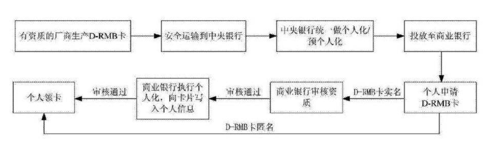
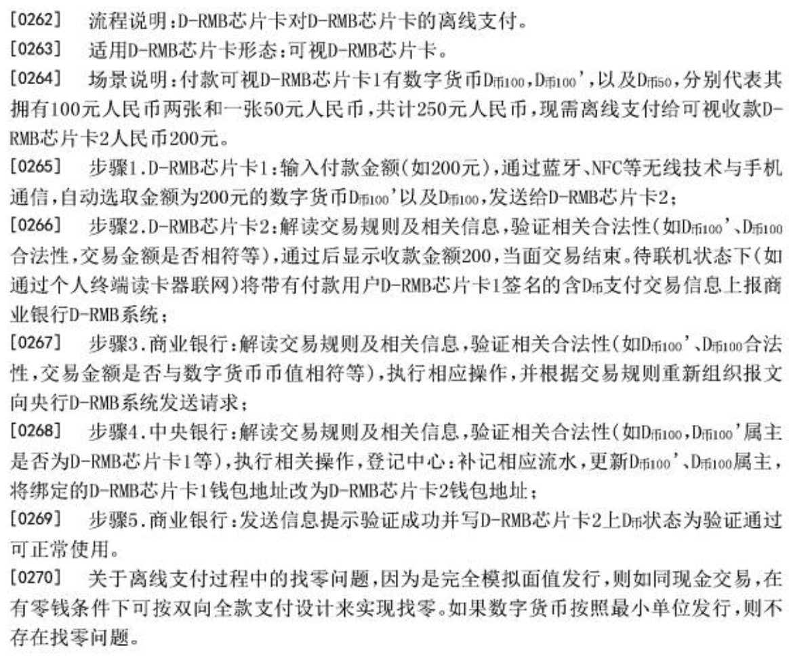
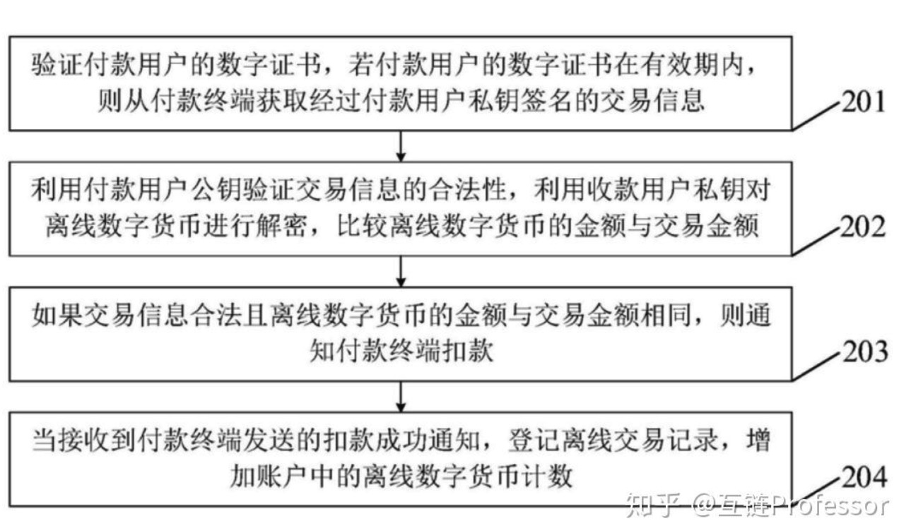
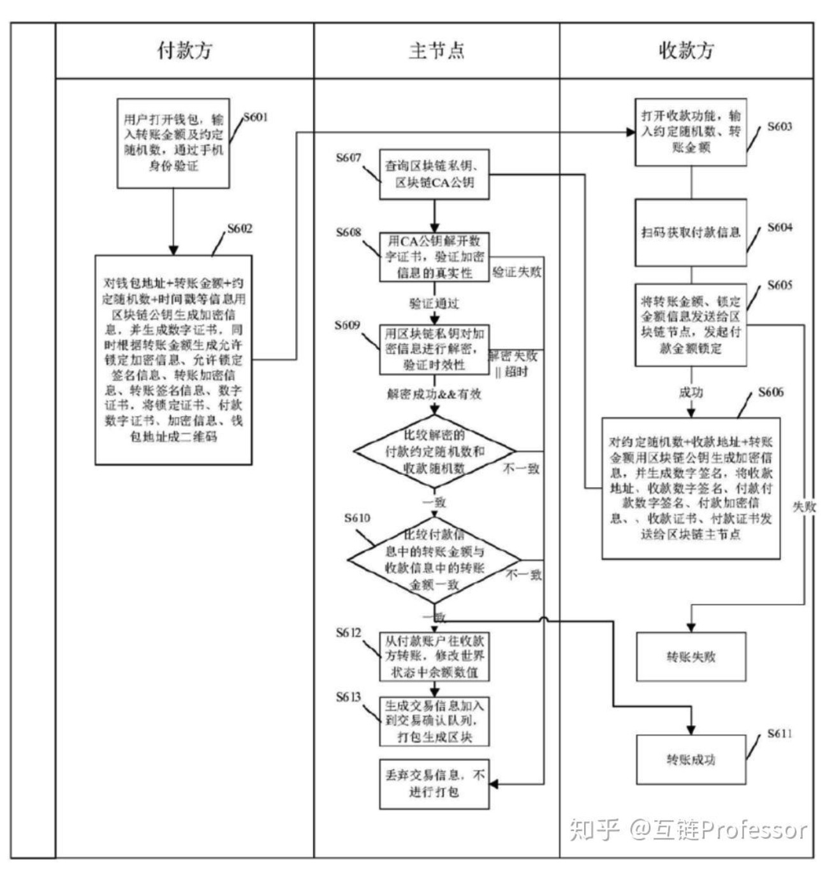

# DC/EP

手机一些权威的声音，为自己的产品做一些调研。

## 中国人民银行支付结算司副司长：
1. 功能属性和纸钞完全一样，只不过形态是数字化的
2. 定义：具有价值特征的数字支付工具
3. 什么叫具有价值特征：**不需要账户**就能实现价值转移
4. 场景：只要你我的手机上都有DCEP的数字钱包，那么连网络都不需要，只要手机有电，两个手机碰一碰， 就能够把一个人数字钱包里的数字货币转给另外一个人，也就是说，你在支付的时候，是不需要绑定任何银行账户的，不像我们现在的微信支付宝，都要绑定一张银行卡，但DCEP不需要了。当然了，除非你要往数字钱包充钱，或者你想从数字钱包里面取钱去理财，除了上面两种，用户与用户之间的相互转账是不需要和进行账户绑定的，这就意味着，DCEP能像纸钞一样流通，这也是为什么说，你可以简单的把它理解为纸钞的数字化替代。
5. 比特别和DCEP：事实上，像比特币这样的加密资产，它最根本的一个优势，就是摆脱了传统的银行账户体系的控制，因为它只是个加密字符串，从这一点上说，DCEP具有同样的优势。那不一样的是什么呢？不一样的是，央行的数字货币属于法币，跟现金一样，央行的数字货币也具有无限法偿性，也就是说，你不能拒绝接受DCEP，我们看到现在很多私营的支付机构或者平台，会设置各种支付壁垒，用微信的地方不能用支付宝，用支付宝的地方不能用微信，但对于行情的数字货币来说，只要你能够用电子支付的地方，就必须接受央行的数字货币。
6. DECP，支付宝，微信的区别：首先从法权上来讲，DCEP的效力和安全性是最好的，你用的纸钞是央行货币，DCEP也是央行发行的，但是你用支付宝或者微信做电子支付的时候，用的是支付宝的电子钱包，或者微信的电子钱包，他们的货币是从哪来的呢，他们不是用央行货币进行结算的，而是用商业银行存款货币进行结算的，在备付金集中存管以后，情况有所变化，也就是说，微信和支付宝在法律地位，安全性上，没有达到和纸钞的同样水平。理论上来讲，商业银行都可能会破产，所以这些年人民银行建立了存款保险制度，但假设微信破产了，微信钱包里面的钱，它没有存款保险，你就只能参加他的破产清算，比如说之前你有100块，现在只能还你1毛，你也只能接受，它是不受央行最后贷款人的保护的。当然这种可能性很小，但你不能完全排除。其次，我们要考虑一些极端的情况，比如大的地震，通信都断了，电子支付当然也就不行了，那个时候，只剩下两种可能，一个是纸钞，一个是央行数字货币，它不需要网络就能支付。我们叫做双离线支付，是指收支双方都离线，也能进行支付。只要你的手机有电，哪怕整个网络都断了，也可以实现支付。我们也可以讲一些不那么极端的，你能感知到的情况，比如你到地下超市去买东西，没有手机信号，微信，支付宝都用不了，又或者，在飞机上，也没有信号，如果你做的是廉价航空公司的航班，吃饭就需要花钱，在这种场景下，原来你只能用信用卡支付，以后也可以用央行的数字货币支付，但这一点，像libra这样的数字货币是做不到的。当然，也有人会问，DCEP会对支付宝，微信的地位产生影响吗？我们的回答是，并不会，因为目前支付宝，微信也是使用人民币支付，其实也就是用商业银行存款货币进行支付，央行数字货币推出后，只是换成数字人民币，也就是用央行的存款货币，虽然支付工具变了，功能也增加了，但渠道和场景都没变。
7. 为什么在电子支付手段如此发达的今天，央行还要做这样一个数字货币呢：首先，为了保护自己的货币主权和法币地位，我们需要未雨绸缪；其次，现在的纸钞. 硬币的发行，印制. 回笼. 贮藏各个环节的成本都非常高，还要投入一些成本做防伪技术，流通体系的层级也比较多，携带又不方便，现在谁也不愿意带现金了，除了犯罪分子不愿意让别人知道或者你也有可能有些消费不想让其他人知道，特意用现金之外，现在绝大部分人用现金的情况是越来越少了，当然只要你不犯罪，你想进行一些不想让别人知道的消费，这种隐私我们还是要保护的。这也就是说，公众是有匿名支付的需求的，但现在的支付工具，比如说互联网支付，银行卡支付都是跟传统银行账户体系紧紧绑定的，它满足不了匿名需求，也就不能完全取代现钞的支付，所以说，央行的数字货币能够解决这些问题，它既能保持现钞的属性和主要的价值特征，又能满足便携和匿名的需求。便利老百姓的支付是一方面，同时还要保持一个平衡，就是不能便利犯罪，推行DCEP，我们同样会遇到反洗钱问题，用纸钞进行洗钱，虽然匿名的程度比较高，但是还是由一定的成本，比如要洗的钱比较多的话，还要用卡车拉，但数字货币这个成本就比较低，那如果推出DCEP后，我们怎么反洗钱呢？
8. 如何反洗钱：我们进行反洗钱，反逃税，反恐怖融资这些工作，都可以用前面提到的大数据的方式，也就是说，虽然普通的交易是匿名的，但是我们用大数据识别出一些行为特征的时候，还是可以锁定这个人真实身份的，举个例子，涉及到很多洗钱的交易，都是有行为特征的，比如说，大量的赌博行为，都发生在夜间12点以后，而且所有赌博的交易都没有零头，都是十的整数倍。一般来说，开头是用小额，越来越大，突然断崖没了，也就是没有交易了，那说明是输光了，这就符合一般的赌博的特征；电信诈骗也是如此，如果出现大量分散的钱集中到一个账户里面，突然又迅速的分散开，消失在很多个账户里面，这就符合明显的电诈的特征。那么我们把这些交易特征分析出来以后，再利用大数据和数据挖掘技术，进行身份比对，就能把后面那个人找出来，所以说，处于反洗钱的考虑，我们对数字钱包也是有分级和限额安排的，比如说你就用一个手机号码注册一个钱包，那么你这个钱包当然可以用，但是级别一定是最低的，只能满足日常小额支付需求，但如果你要能上传一下身份证，或者是再上传一个银行卡，就可以获得更高级别的数字钱包，如果你还能到柜台去面签一下，那可能就没有限额了。
9. 它的本质是现钞的替代，虽然在央行这一层，我们**并没有采用区块链技术**，但我们把区块链的内核拿了出来，也就是说，它是具有价值特征的数字支付工具，脱离账户也可以进行价值转移，能够满足可控匿名的支付需求。同时我们也讲了央行数字货币反洗钱的手段，任何一种支付工具，都需要在便利性和合法上进行平衡。

## 央行方案

央行就提出了数字货币双离线的特征要求包括：

1. 安全性：能防止商务中的任意一方更改或非法使用数字货币；
2. 不可重复花费性：数字货币只能使用一次，重复花费能被容易地检查出来；
3. 可控匿名性：银行和商家相互勾结也不可能跟踪数字货币的使用，要求系统无法将电子现金的用户的购买行为联系到一起，从而隐藏数字货币用户的购买历史，但数字货币的发行方可跟踪数字货币的使用；
4. 不可伪造性：用户不能伪造假的数字货币；
5. 公平性：支付过程是公平的，保证要么双方交易成功，要么双方都没有损失，防止某一交易方在交易中蒙受损失；
6. 兼容性：央行数字货币系统中的数字货币发行流程与流通环节尽可能参照实物货币发行与流通。

2019 年开始，央行数字货币的特点陆续对外披露，都不外乎上述要求。值得注意的是，此专利的发明牵头人是“姚前”，后来担任央行数字货币研究所所长，现任证监会科技监管局局长。

但是在此专利中，“双离线”支付的实现是通过一种“芯片卡”。根据专利中的描述，交易双方的离线支付是通过 NFC. 红外或者蓝牙等近场通讯手段实现。要求交易终端需要数字货币芯片卡，芯片卡的形态包括了可视蓝牙 IC 卡. IC 卡. 手机-eSE 卡. 手机-安全 SD 卡. 手机-SIM 卡等。

这种芯片卡具有验证数字货币真伪. 交易合法性等功能。应该是一种加密的，具有强大抗破解能力的芯片卡。根据专利的说明，需要有资质的厂商生产这种芯片卡，然后投放到商业银行及个人终端。

换句话说，央行通过标准统一的芯片，建立了一套离线支付体系。但这个成本也是巨大的，即要求所有的支付节点都要安装这个芯片。这可能是该方法现在没有采用的原因。

但央行数字货币的原则却一直没有改变。

例如 A 用户的电子钱包中有 D100，现在 A 用户在离线的情况下需要支付 D100 给 B 用户。

1. A 用户打开 APP 后，选择离线支付功能，输入付款金额和接收方信息后点击支付。
2. A 用户对上述信息利用自己的私钥进行签名，并用收款人的手机号或者其他标识收款人的信息通过 NFC 等近场通讯的方式进行加密传输。
3. B 用户 APP 接收到加密信息后，解密并验证 D 币的合法性，以及金额是否等值。此时对于 A. B 用户来说已经完成了双离线支付，但是此时 B 其实并没有真正收到 A 转给他的 D 币，在 APP 界面上来说，接受到的 D 币应该是出于不正常状态（不可用）。接下来，B 用户的 APP 会在联机状态后，将支付信息发送给商业银行数字货币系统。
4. 商业银行收到这个支付信息后，在校验了合法性后，会将这个信息发送给央行数字货币系统。
5. 央行数字货币系统收到支付信息后，在完成与在线支付一样的校验后，就会更改属主，将原本属于 A 的 D 币，变更为 B 用户，最后将结果返回给商业银行。
6. 商业银行收到成功信息后，通知 A. B 用户 APP 发送交易成功的消息，此时 B 用户接收到的 D 币状态才会变成可用状态。

因此，如果 A 转给 B，那么 B 在联网之前，A 转给 B 的 D 币无法转给 C 的，这个双离线支付并不能完成链式的支付。

总的来说，该过程可以类比为付款方现场开具支票，收款方事后凭支票去银行兑现。

在上述双离线支付场景中，电子支付对离线支付过程中可能出现的重复支付的检查是滞后的，即只能在支付完成后实施。

若用户利用某些漏洞实施了双花，从专利来看，是通过事后追责的形式来处理的，即对不良记录将录入征信系统以作惩戒。

当然，系统在具体实现时，也可设定离线支付的最大支付额度（如1000元），以规避风险。

## 工行方案1

据专利说明，其实现方式是
1. 向付款终端发送收款用户标识. 收款用户公钥以及收款用户的数字证书，
2. 并接收所述付款终端发送的付款用户标识. 付款用户公钥以及付款用户的数字证书；
3. 如果所述数字证书在有效期内，则接收付款终端发送的经过付款用户私钥签名的交易信息，所述交易信息包括付款用户支付的离线数字货币，所述离线数字货币经过所述收款用户公钥加密；
4. 利用所述付款用户公钥验证所述交易信息的合法性，并利用所述收款用户私钥验证所述离线数字货币的有效性（解密）；
5. 如果所述交易信息合法且所述离线数字货币有效，则通知所述付款终端扣款；
6. 当接收到所述付款终端发送的扣款成功通知，登记离线交易记录，增加账户中的离线数字货币计数。

数字货币的代理会负责生成币编号. 面值. 币种. 单位. 版本号. 前手币编号. 代理投放机构标识. 数字签名等要素组装，并通过加密机加密生成数字货币加密字符串，即为数字货币。

## 工行方案 - 区块链

1. 由各银行主节点组成区块链主干网络
2. 用户轻节点接入区块链主干网络，通过非对称加密技术对付款方转账信息进行加密传输保障资金安全和通信安全，由付款方输入转账金额，用户钱包对用户信息. 转账金额等信息进行非对称加密及签名并发送到主干网中进行交易验证，验证通过即把交易信息进行区块打包加入到区块链中，若干后继区块产生后即完成交易，可达到防篡改的目标，从而达到了现实世界中离线快捷支付。
3. 具体来说就是钱包地址. 转账金额. 约定随机数. 时间戳等信息通过区块链公钥生成加密信息以及数字证书，同时可以锁定签名信息. 转账加密信息. 转账签名信息. 将这些信息生成付款二维码。收款方就可以扫码对上述信息生成数字签名。当有网络的时候，上传到区块链主节点。

## 闪电网络qe
闪电网络其实就是off chain的设计思路，在layer 2保存交易历史而不记录在区块链上。假设A要跟B买东西，转账给B. 只需要一个2个人同时签名的交易，存在两个人任何一个人的设备都可以（或者同时存）。在有网络的时候把这个交易发布到区块链。因为是同时签名的，所以谁去发布这个交易都可以。

但这样会有双花的问题，所以会需要有保证金等其他的约束，或者设定一个上限只支持小额付款。因此，使用这样的方式是并不利于管控和应用的，况且是体量如此大的中国人民币经济体中。

因此，大概有这样几个思路的猜想。

1. 对自己的加密算法足够的自信，A - B, A 扣掉钱之后，本地加密存储。

2. 破解密码的成本远远高于A用户里面的钱，破解无利可图。

3. 法律层面，对用户离线丢钱提供保护，还有保险。

4. 黑科技，特殊的硬件设备，可以实现物理级别的，不可逆转的记录。

在我们现有的人民币经济体中，人民币的管控最重要的是可以线下交易兑换，而银行体系在国家监管体系下建立另一套账户系统，而法律则将关于现金的违规操作进行治理。只要在宏观上控制总量，即可进行经济调控。

当货币成为数字货币后，与人民币锚定，技术上一定会有人钻空子寻求获利，而法律机构也会根据这些风险来去制定相应法规约束。但在设计上最好的情况是控制相应的流通场景，因为当数字货币具备人民币交易价值时，会关联到人民币的外汇体制。适当的管控一定是需要控制带来的风险。即使在双离线支付技术以及账本上都实现了安全可信，但在流通上，需要杜绝可能发生的及经济风险。

## 比较可信的实现

双离线支付的原理，网传的版本很多，比较可信的一种是：

在支持TEE（可信执行环境）的手机里，规定离线支付需要通过TEE进行签名并且检查确认没有进行过双重支付。这个时候双离线支付的安全实际上交给支持TEE芯片的生产商进行担保，也就是说TEE安全，双离线支付就安全。

> 可信执行环境(TEE)是主处理器内的安全区域。它运行在一个独立的环境中且与操作系统并行运行。它确保TEE中加载的代码和数据的机密性和完整性都得到保护。通过同时使用硬件和软件来保护数据和代码，这个并行系统比传统系统(即REE，也就是富执行环境)更加安全。在TEE中运行的受信任应用程序可以访问设备主处理器和内存的全部功能，而硬件隔离保护这些组件不受主操作系统中运行的用户安装应用程序的影响。TEE中的软件和加密隔离相互保护不同的受信任应用程序。

这样，TEE就充当了一个中心化的机构，它有类似银行的作用，破坏TEE的技术难度较大而且成本较高，另外，手机芯片也是实名的，如果TEE芯片安全性被破坏，则可以追责并且可以将该设备列入到黑名单。

双离线支付中，收到的钱需要在上线后，同步到帐本中才能再次使用。

可以简单的理解为：双离线支付中，存在一个中心化的桥梁，我们相信交易没有问题是因为我们相信这个桥梁，交易时可以离线，但只有等到同步到帐本后，才算真正完成了交易，只不过后面这一步我们不需要参与。

## 猜测

1. 这不是单纯靠技术能解决的问题，以为技术可以解决所有问题的想法是错的。这个问题的解决需要结合法律. 经济激励和技术。技术方面：如果采用区块链方案，可参考采用比特币BSV解决方案。交易合法性最终总是要在线核验。需确保按约定规则可鉴别双花。法律方面：付款方恶意双花及伪造违法，列为金融欺诈。对于采用区块链的方案而言，如果矿池将一步双花交易打包，则将此矿池列为金融欺诈主犯之一。经济激励方面：收款方，可以设置接受小额离线收款的最大金额，以权衡收款便利性和安全性。
2. esim卡或者sim卡是整个技术的核心。目前是sim，但进一步肯定是通过esim。央行对于esim技术的推广充满信心，通过利用esim卡的性质来完成用户识别模块的建立。我看了新闻，里面特意提了用手机号就可以实现交易。esim就是创造可信环境的关键。
3. 此前业内曾尝试手机NFC支付技术，但是遇到设备兼容性较差. 手机普适性低. 行业利益链复杂等诸多挑战。在将各种技术尝试一遍之后，业内发现在中国的现状下只有二维码技术可以突破这些限制，也是在兼容性. 普适性和用户使用习惯下的最佳载体。从2015年底到2016年初，支付宝以二维码作为切入点，开始探索离线二维码技术方案的设计与测试。2016年的8月17日杭州公交扫码乘公交的开通，标志离线二维码技术从实验室正式推向商业化试点。可以保证了在0.3秒内，在闸机. 手机双双离线的情况也可以保证市民顺利刷卡乘车。

## App界面

上面就是内测钱包的截图，DCEP钱包将支持
1. 数字资产兑换
2. 数字钱包管理
3. 数字货币交易记录查询
4. 钱包挂靠等功能
5. 也支持了扫码支付
6. 汇款收付款
7. 手机芯片支付等基础功能。

## 参考资料

1. [五分钟带你了解央行数字货币DCEP](https-//www.bilibili.com/video/BV1XE411q77U?from=search&seid=16593852520976895395)
2. [听央行高管讲数字货币](https://www.bilibili.com/video/BV1Li4y1t762/?spm_id_from=333.788.videocard.3)
3. [北大数字金融公开课第八讲——徐远：《揭开央行数字货币神秘面纱》](https://www.bilibili.com/video/BV1C64y1T7VN/?spm_id_from=trigger_reload)
4. [央行数字货币dc/ep双离线支付，技术层面如何避免诈骗？](https://www.zhihu.com/question/345687500)
5. [数字钱包的双离线支付技术何解？](https://www.lieyuncj.com/p/11732)