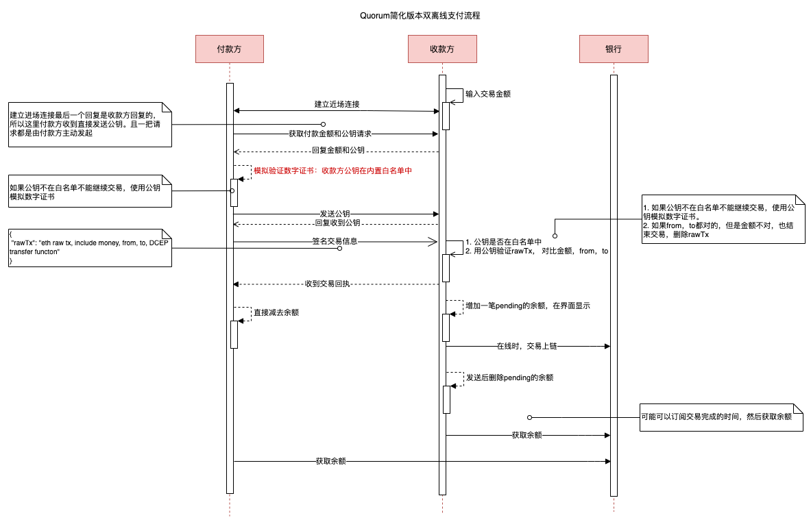

# 11. 双离线支付

Date: 2020-08-25

| 制定者 | 版本 | 备注 |
| --- | --- | --- |
| 沈寅，张诚 | v0.0.1| 流程图，一些问题的讨论，妥协 |
| 沈寅 | v0.0.2| 增加 TEE，SE，TPM 的描述 |
| 沈寅，张诚 | v0.0.3| 基于以太坊的实现方案和限制 |

## 状态

2020-08-25 proposed

## 背景

背景请查看
1. [《DCEP相关媒体》](../DCEP相关媒体.md)，该文章里面有一些产品设计和技术方案的信息，作为本文档的输入。
2. [《双离线支付方案》](https://docs.google.com/document/d/1Sp5wKWdYV3GXQXScWi0MEbQ9cA7kZjK39ranVAFapmg/edit)，倩倩和张诚的调研，本文档在于进一步细化该文档到落地级别。

DCEP或将采用“一币两库三中心”架构，两库指的是央行发行库和商业银行的银行库，三中心包括认证中心、登记中心和大数据分析中心。这其中，认证中心负责央行数字货币机构及用户的真实身份信息采集等管理工作。登记中心负责记录数字货币和用户钱包记录 ，完成权属登记，同时记录数字货币发行、转移、回笼全过程信息。大数据分析中心旨在运用大数据分析DCEP的 发行 、流通 、贮藏等，具有反洗钱 、支付行为分析、监管调控指标分析等功能。

## 核心目标

1. DECP的建模
2. 防伪
3. 防双花

## 复杂版本的设计

### 前提条件

一个手机的DCEP APP一次性只能给另一个DCEP APP发送交易

### 支付

1. 收款方输入交易金额
2. 收款方开启广播模式，广播收款信息（广播的时候信息有限制，可能是32个字节）
    1. 金额
    2. 昵称
    3. 交易ID
3. 付款方开启蓝牙，扫描附近的收款方蓝牙信息，付款方主动发起连接
4. 建立安全的信息通道（在BLE基础上应用层再封装）
    1. 付款方ask收款方的随机公钥（专门用于通信）
    2. 收款方answer付款方随机公钥
    3. 付款方使用付款方的随机公钥加密一个随机的AES密钥给收款方
    4. 收款方使用协商的 AES 密钥加密回复一个确认应答
    5.  协商对称加密的算法和秘钥（目前简化方案不考虑）
5. 获取付款方信息
    1. 付款方将自己的数字证书加密给收款方，数字证书里面可以验证公钥，数字证书本身可以用根证书验证
    3. 收款方回复加密确认
6. 付款方获取付款信息并验证收款方
    1. 金额
    2. 收款方验证和存证收款方信息
    3. 付款方验证收款方信息
        - PKI 系统，使用根证书验证收款方证书（需要拍板）
        - DID系统，使用 DID 验证对方身份（DID，要联网拿公钥，不行）
        - 验证金额（用户自己查看显示）
7. 验证成功后，发送 DCEP
    1. 有小数（用此方案，精确分）
    2. 定额（需要对手方找零，复杂，暂不采用）
    3. 用自己的私钥签名交易
8. 收款方验证金额和签名
    1. 验证签名是付款方签名的
    2. 验证金额是正确的
    3. 发起回执，包含 sign<发送方，金额，自己，交易ID>，
9.  付款方验证收款方回执
    1. 成功扣除金额
10. 如果回执接受不到，可以有两个颁发，一个是离线的，一个是在线的
    1. 上线后，银行通知双方更新约
        - 银行不保存余额，只是把交易信息下发，客户端更新，钱包主导货币的管理
        - 银行保存余额，客户端以线上为准（采用此方案）
    2. 蓝牙重新连接后，可以再次发送回执，需要手机本地保存回执
0；。、你h'vnvb

图的源文件在 https://app.diagrams.net/#G1NFN4hWRI1npXVk9iC4ldqX8gEFdyRyrH

### 发行兑换

1. 用户 A 兑换任意金额的 DCEP（简化版本，默认10元，不需要支付任何东西）
2. 系统派发商业银行Bank签名的 DCEP，格式如下：
   1. 钱的序号 ：001
   2. 金额：10
   3. 中央银行签名：signatureOfCB
   4. 商业银行签名：signatureOfBank
3. 用户 A 使用 CB 和 B 的公钥验签（内置两枚公钥，APP可能是商业银行提供）
4. 验签成功，系统提示入账 10 元 DCEP
5. 验签失败，系统提示“兑换失败，请稍后重试”

## 复杂版本方案制定过程中的疑问记录

1. 验证官方的APP，是否增加合法APP公钥？
	1. 这个可以在蓝牙连接的时候做，检测app的证书
2. 蓝牙是类似TCP的可靠传输，所以不存在丢包，但可能断掉。
3. 收款方需要把公钥给付款方吗？
	1. 需要，把公钥保存在数字证书里面
4. 发送交易是调用transfer还是approve或者还是其他
	1. 现在 transfer 比较合适，可以后面上链
	2. approve 需要后面再调用 transferfrom，多走一步，而且还有个allowance函数
5. 离线状态 transfer 以后，线上余额并不会改变，此时是否可能有另外一个钱包，也去花相同账户的钱
   1. DCEP是没有账户概念的，所以钱是在钱包里面，不在线上，和纸币的性质一样
   2. 每一笔钱都是有唯一标识的，如果两个钱包都有同样标识的一笔钱，且都有私钥，那么可以同时花费
   3. 如果同时上线，可能有双花
   4. 如果一个钱包在线上把钱花完了，另一个钱包同时正在离线支付，收款方上线后发现钱已经被花了，则只能追责
   5. 可以由硬件绑定一批次的 DCEP，相同的 DCEP 不能同时存在于两个钱包
6. 付款方数字证书的问题
	1. 没有数字证书<交易公钥，电话，身份证>，就有可能被盗取一笔签名的交易去双花
		- 假定A用户签名了一笔交易
		- 黑个H盗取了交易并使用该DCEP
		- 如果不验证身份，只验证DCEP的合法性，就会留下漏洞（此处张诚认为概率很小，所以优先级低）
	2. 假设有身份证书，那要有撤销机制（是的）
	3. 离线不能验证被撤销的证书（但是可以确定责任人）
	4. 盗用别人的证书怎么办？（证书可能和安全硬件绑定了）
6. 双方的时间需要对上吗，交易需要有时间戳吗？
   1. 暂时没想到有必要

### 是否采取复杂版本的设计？

1. 由于DC/EP还没有推出，我们的后台仍然使用Quorum去模拟该产品，所以有一些需要妥协的地方
2. 由于时间关系，我们主要的投入点仍然在POC的建立，所以一些安全性和完整性等细节方面，我们只能在 ADR 和调研文档中提及，在代码级别需要妥协。

## 基于Quorum版本的设计

### 整体方案重要，但是POC决定妥协的部分

| 原方案 | 妥协成 |
| --- | --- |
| 安全的通信通道 | 不考虑 |
| APP的数字证书及其验证 | 不考虑APP的合法性 |
| 双方的数字证书及其验证 | 不验证双方的身份，相信其发送的公钥是其本人的 |
| 商业银行的数字证书 | 不考虑 |
| 央行的数字证书 | APP 内置银行的公钥验证 |
| 交易回执收不到的情况 | 收款方上线同步余额，不做蓝牙状态的恢复 |
| 上线后通知交易成功 | 改为轮询 |
| 链式转移 DCEP | 不支持，没有上线确认状态为不可用 | 
| TEE，SE，TPM等硬件 |  不考虑安全的执行环境和存储 | 

### quorum 的限制

| 限制 | 原因 | 解决方法| 决定 |
| --- | --- | --- | --- |
| DCEP 的表达 | 以太坊是基于账本的，与DCEP模型不符合 | 1. 不建模 2.如果需要可以用智能合约建模 | 用 ERC721建模，用ERC1155支持批量转移 |
| DID | 不能联网，无法使用 | 1. 互传公钥，用白名单 2.也可以使用多级证书机制 3. 不验证身份 | 不验证身份|
| nonce 获取不到 | 不能联网 |  1. 付款方需要先联网获取 nonce， 然后才能双离线 2. 换链 3. 付款方上线后发送交易 |  方案1|
| 银行的数字签名 | 以太坊并不需要 | 1. 不包含。2. 包含在智能合约。3. 包含在服务端 | 参考游戏的做法，每一个 NFT 都有一个 URI 从服务端获取属性 | 

### DC/EP 建模

使用 ERC721建模，用 ERC1155 支持批量转移：

| 字段 | 含义 | 产生方法 |
| --- | --- | --- |
| 冠字号 | 人民币纸币上的编码，“冠字”是印在纸币上用来标记印刷批次的两个或三个英文字母，由印钞厂按一定规律编排和印刷；“号码”则是印在冠字后面的阿拉伯数字流水号，用来标明每张钞票在同冠字批次中的排列顺序 | 服务端生成，保存到合约，做为 NFT 的标识，比如 <CB_价值_序号>: CB_100_00000000000001标识100元 |
| 基本加密密码 | 央行的主密码与面额数字 1，5，10，20，50，100 分别产生 6 个基本加密密码。这 6 个加密密码分别是用于不同面额的数字货币。| 由服务端指定 |
| 主密码 | 和加密密码配合使用 | 有服务端指定|
| 随机数加密 | 特点hash算法生成的随机数 | 服务端指定算法生成 |
| 加密密码 | 基本加密密码与随机数加密两次加密过程，生成加密密码，这个加密密码即对应特定冠字号的DCEP数字货币 | 服务端拼一下 |
| 央行签名 | 钞票的数字签名，服务端模拟央行，通过私钥对加密密码进行签名，此时一枚新的法定数字货币就产生了| 服务端签名提供URI获取|
| 商业银行签名 |  作用：1. 盲签名那边要用 2. 两个主题，产品上更合理 | 服务端签名提供URI获取 |

### 基于 Quorum 的流程图

## 参考文档：
1. [公钥、私钥、签名、数字证书的关系(图文)](https://www.jianshu.com/p/3c5212b47bec)
2. [Difference between TPM, TEE and SE](https://security.stackexchange.com/questions/122738/difference-between-tpm-tee-and-se)
