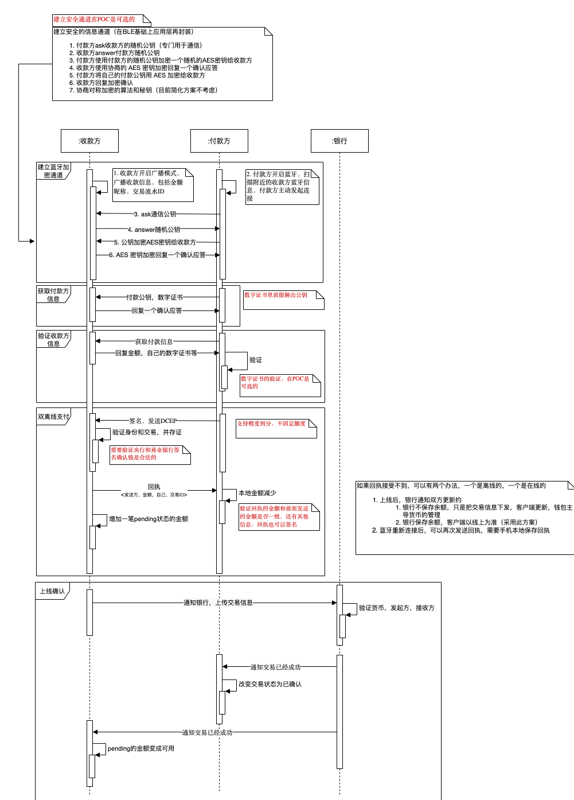

# 11. 双离线支付

Date: 2020-08-25

制定者：沈寅，张诚

## 状态

2020-08-25 proposed

## 背景

背景请查看
1. [《DCEP相关媒体》](../DCEP相关媒体.md)，该文章里面有一些产品设计和技术方案的信息，作为本文档的输入。
2. [《双离线支付方案》](https://docs.google.com/document/d/1Sp5wKWdYV3GXQXScWi0MEbQ9cA7kZjK39ranVAFapmg/edit)，倩倩和张诚的调研，本文档在于进一步细化该文档到落地级别。

## 设计

### 前提条件

一个手机的DCEP APP一次性只能给另一个DCEP APP发送交易

### 支付

1. 收款方输入交易金额
2. 收款方开启广播模式，广播收款信息（广播的时候信息有限制，可能是32个字节）
    1. 金额
    2. 昵称
    3. 交易ID
3. 付款方开启蓝牙，扫描附近的收款方蓝牙信息，付款方主动发起连接
4. 建立安全的信息通道（在BLE基础上应用层再封装）
    1. 付款方ask收款方的随机公钥（专门用于通信）
    2. 收款方answer付款方随机公钥
    3. 付款方使用付款方的随机公钥加密一个随机的AES密钥给收款方
    4. 收款方使用协商的 AES 密钥加密回复一个确认应答
    5.  协商对称加密的算法和秘钥（目前简化方案不考虑）
5. 获取付款方信息
    1. 付款方将自己的数字证书加密给收款方，数字证书里面可以验证公钥，数字证书本身可以用根证书验证
    3. 收款方回复加密确认
6. 付款方获取付款信息并验证收款方
    1. 金额
    2. 收款方验证和存证收款方信息
    3. 付款方验证收款方信息
        - PKI 系统，使用根证书验证收款方证书（需要拍板）
        - DID系统，使用 DID 验证对方身份（DID，要联网拿公钥，不行）
        - 验证金额（用户自己查看显示）
7. 验证成功后，发送 DCEP
    1. 有小数（用此方案，精确分）
    2. 定额（需要对手方找零，复杂，暂不采用）
    3. 用自己的私钥签名交易
8. 收款方验证金额和签名
    1. 验证签名是付款方签名的
    2. 验证金额是正确的
    3. 发起回执，包含 sign<发送方，金额，自己，交易ID>，
9.  付款方验证收款方回执
    1. 成功扣除金额
10. 如果回执接受不到，可以有两个颁发，一个是离线的，一个是在线的
    1. 上线后，银行通知双方更新约
        - 银行不保存余额，只是把交易信息下发，客户端更新，钱包主导货币的管理
        - 银行保存余额，客户端以线上为准（采用此方案）
    2. 蓝牙重新连接后，可以再次发送回执，需要手机本地保存回执

图的源文件在 https://app.diagrams.net/#G1NFN4hWRI1npXVk9iC4ldqX8gEFdyRyrH

### 兑换

1. 用户 A 兑换任意金额的 DCEP（简化版本，默认10元，不需要支付任何东西）
2. 系统派发商业银行Bank签名的 DCEP，格式如下：
   1. 钱的序号 ：001
   2. 金额：10
   3. 中央银行签名：signatureOfCB
   4. 商业银行签名：signatureOfBank
3. 用户 A 使用 CB 和 B 的公钥验签（内置两枚公钥，APP可能是商业银行提供）
4. 验签成功，系统提示入账 10 元 DCEP
5. 验签失败，系统提示“兑换失败，请稍后重试”

## 结论

1. 由于DCEP还没有推出，我们的后台仍然使用quorum去模拟该产品，所以有一些需要妥协的地方
2. 由于时间关系，我们主要的投入点仍然在流程的打通和POC的建立，所以一些安全性和完整性等细节方面，我们只能在ADR和调研文档中提及，在代码级别需要妥协。

### 决定妥协的部分

| 原方案 | 妥协成 |
| --- | --- |
| 安全的通信通道 | 不考虑 |
| APP的数字证书及其验证 | 不考虑APP的合法性 |
| 双方的数字证书及其验证 | 不验证双方的身份，相信其发送的公钥是其本人的 |
| 商业银行的数字证书 | APP 内置商业银行公钥，验证 |
| 央行的数字证书 | APP 内置商业银行的公钥，验证 |
| 交易回执收不到的情况 | 收款方上线同步交易，付款方再次获取交易成功回执，不做蓝牙状态的恢复 |
| 上线后通知交易成功 | 改为轮询 |
| 链式转移 DCEP | 不支持，没有上线确认状态为不可用 | 
| DCEP 模拟 | 使用以太坊 DCEP 合约，据资料表明，央行并没有用区块链，所以肯定有很大区别 | 
| 余额是由钱包决定还是由银行系统决定 | 目前定位由quorum模拟银行，quorum中有账本 |

## 方案制定过程中的疑问记录

1. 验证官方的APP，是否增加合法APP公钥？
	1. 这个可以在蓝牙连接的时候做，检测app的证书
2. 蓝牙是类似TCP的可靠传输，所以不存在丢包，但可能断掉。
3. 收款方需要把公钥给付款方吗？
	1. 需要，把公钥保存在数字证书里面
4. 发送交易是调用transfer还是approve或者还是其他
	1. 现在 transfer 比较合适，可以后面上链
	2. approve 需要后面再调用 transferfrom，多走一步，而且还有个allowance函数
5. 离线状态 transfer 以后，线上余额并不会改变，此时是否可能有另外一个钱包，也去花相同账户的钱
   1. DCEP是没有账户概念的，所以钱是在钱包里面，不在线上，和纸币的性质一样
   2. 每一笔钱都是有唯一标识的，如果两个钱包都有同样标识的一笔钱，且都有私钥，那么可以同时花费
   3. 如果同时上线，可能有双花
   4. 如果一个钱包在线上把钱花完了，另一个钱包同时正在离线支付，收款方上线后发现钱已经被花了，则只能追责
   5. 可以由硬件绑定一批次的 DCEP，相同的 DCEP 不能同时存在于两个钱包
6. 付款方数字证书的问题
	3. 没有数字证书<交易公钥，电话，身份证>，就有可能被盗取一笔签名的交易去双花
		- 假定A用户签名了一笔交易
		- 黑个H盗取了交易并使用该DCEP
		- 如果不验证身份，只验证DCEP的合法性，就会留下漏洞（此处张诚认为概率很小，所以优先级低）
	2. 假设有身份证书，那要有撤销机制（是的）
	3. 离线不能验证被撤销的证书（但是可以确定责任人）
	4. 盗用别人的证书怎么办？（证书可能和安全硬件绑定了）
6. 双方的时间需要对上吗，交易需要有时间戳吗？
   1. 暂时没想到有必要

## 参考文档：
[公钥、私钥、签名、数字证书的关系(图文)](https://www.jianshu.com/p/3c5212b47bec)
