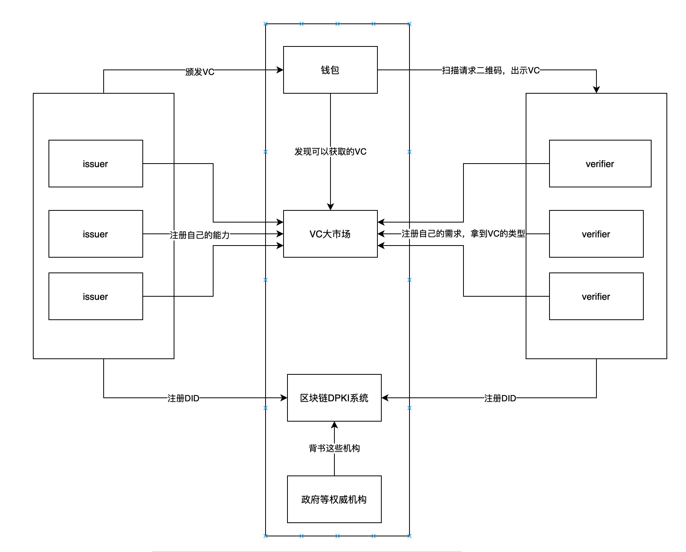
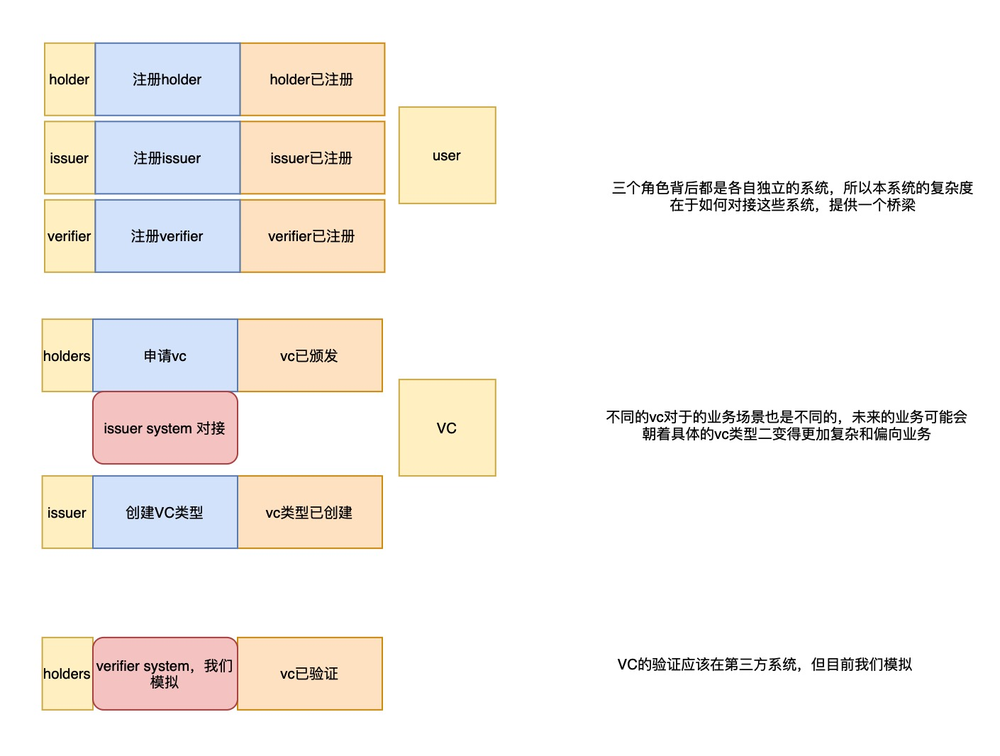

# 14. VC大市场

Date: 2020-12-30

## Status

2020-12-30 proposed

## Context

目前有如下事实：
1. 有很多机构或者个人可以颁发VC
2. 有很多场景需要验证这些VC

**那么现在有个棘手的问题，因为VC的使用场景和颁发场景是高度分散的，那么如何去串联这些场景呢？**

为了解决这个问题，我们提出了VC大市场的概念，他应该有如下的功能：
1. issuers可以在市场里面提供可以颁发的VC，holders和verifiers可以搜索或者发现这些VC
2. holders可以在市场中查看自己可以申请哪些VC，可以在哪些场合使用
3. verifier可以在市场中提出需求，并且展示自己的服务
4. 钱包应该是个离线的存贮VC和私钥的工具，但是钱包也应该又能转移VC，可以通过p2p，也可以通过VC大市场，所以VC大市场也可以作为钱包服务端
5. VC大市场应该可以对接各个issuers的接口
6. VC大市场应该可以对接个多的服务，比如IPFS

进一步讨论的细一些，本次迭代的最主要需求是让verifier可以指定自己需要的vc，用户可以选择拒绝。大市场可以做以下工作：
1. 提供issuer支持的所有vc种类
2. verifier可以选择几个种类生产二维码
3. holder可以扫码二维码，并决定是否出示
4. verifier可以验证用户出示的二维码是否符合要求
这些功能都可以在vc大市场的服务端去做。

## Decision

本服务作为tw-wallet的后端，主要提供DID的注册，区块链信息查询，VC的管理功能，DDD模型如下

## Consequences

Consequences here...
